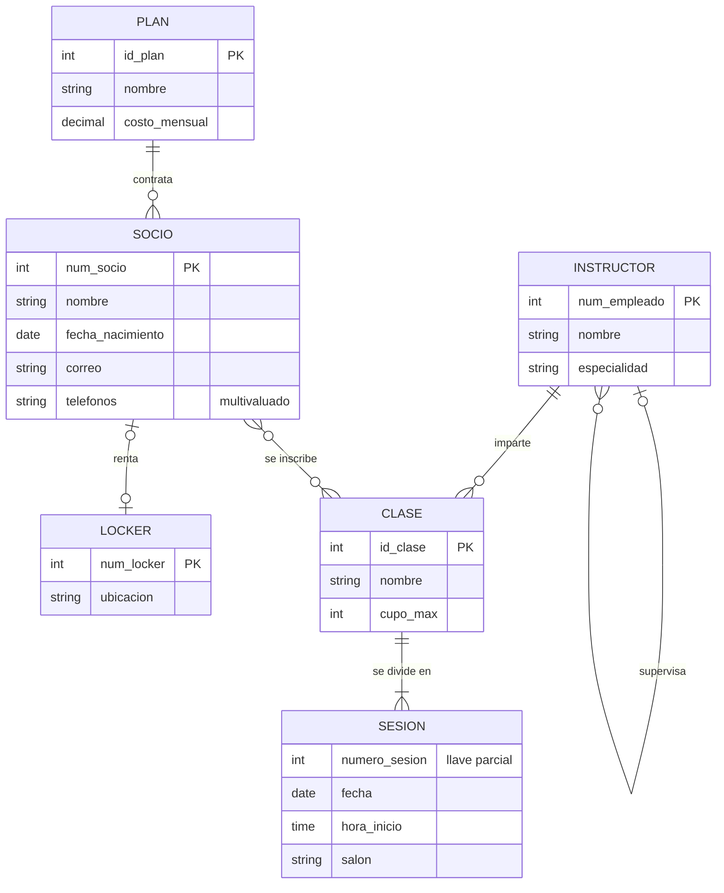

# Calentamiento: caso Gimnasio

**20 minutos, en equipo.** Escriban el esquema en `equipos/equipo-XX/gimnasio.md` y respondan las preguntas de criterio en el documento de Google.

Elegí un dominio que no es de ningún equipo a propósito: quiero que practiquen las reglas sin cargar con las decisiones de su propio proyecto. El caso tiene, en poco espacio, todos los tipos de relación que vimos el viernes.

## El negocio

Un gimnasio de Cuautitlán Izcalli quiere una base de datos. Esto es lo que me contó la dueña:

> Cada **socio** tiene un número de socio, nombre, fecha de nacimiento y correo. Nos dejan uno o varios **teléfonos** de contacto.
>
> Cada socio contrata exactamente un **plan** (Básico, Plus, Premium). Cada plan tiene un nombre y un costo mensual. Un plan lo tienen muchos socios, y puede haber un plan nuevo que todavía nadie ha contratado.
>
> Tenemos **lockers** numerados, cada uno con su ubicación. Un socio puede rentar a lo más un locker, y un locker lo renta a lo más un socio. Hay lockers libres y hay socios sin locker.
>
> Los **instructores** tienen número de empleado, nombre y especialidad. Algunos instructores supervisan a otros; cada instructor tiene a lo más un supervisor. La coordinadora general no tiene supervisor.
>
> Ofrecemos **clases** (Spinning, Yoga, Box…) con un nombre y un cupo máximo. Cada clase la imparte exactamente un instructor; un instructor puede impartir varias clases o ninguna.
>
> Cada clase tiene **sesiones**: la sesión 1, la sesión 2, etc. de esa clase, cada una con fecha, hora de inicio y salón. La "sesión 3" no significa nada si no sabes de qué clase es.
>
> Los socios se **inscriben** a las clases. Un socio puede inscribirse a varias clases y una clase tiene muchos socios. Guardamos la fecha de inscripción y el estatus (activa o dada de baja). Ah, y pasa seguido que alguien se da de baja de Yoga en marzo y se vuelve a inscribir en junio.

## Diagrama E/R

> Mermaid no dibuja atributos sobre las relaciones ni distingue entidades débiles. Por eso lo importante está en la descripción de arriba: la inscripción lleva `fecha_inscripcion` y `estatus`, y `SESION` es una entidad débil de `CLASE`.

## Qué tienen que producir

En `equipos/equipo-XX/gimnasio.md`, el esquema relacional completo con la notación de [`guias/notacion.md`](../guias/notacion.md): todas las tablas, todas las llaves primarias, todas las foráneas y el `?` donde corresponda.

Una pista: deberían salir más de seis tablas. Si les salieron exactamente seis, se les olvidó algo que no aparece como entidad en el diagrama.

## Preguntas de criterio (van en el documento de Google)

1. **Teléfonos.** ¿Qué hicieron con el atributo multivaluado? ¿Cuál es la llave primaria de la tabla resultante?
2. **Locker.** La relación es 1:1 con participación opcional de los dos lados. ¿En qué tabla pusieron la llave foránea y por qué ahí? ¿Qué restricción adicional necesita esa columna para que la relación siga siendo 1:1?
3. **Supervisor.** ¿Cómo quedó la relación recursiva? ¿La llave foránea admite `NULL`? ¿Qué pasaría con la coordinadora general si no lo admitiera?
4. **Sesión.** ¿Cuál es la llave primaria de `SESION`? ¿Por qué `numero_sesion` solo no alcanza?
5. **Inscripción.** Relean el último renglón de lo que dijo la dueña. ¿Cuál es la llave primaria de la tabla de inscripción? Si su primera respuesta fue (`num_socio`, `id_clase`), expliquen qué pasa en junio.
6. **Plan.** "Cada socio contrata *exactamente* un plan." ¿Cómo se refleja la palabra *exactamente* en su esquema?

hola 